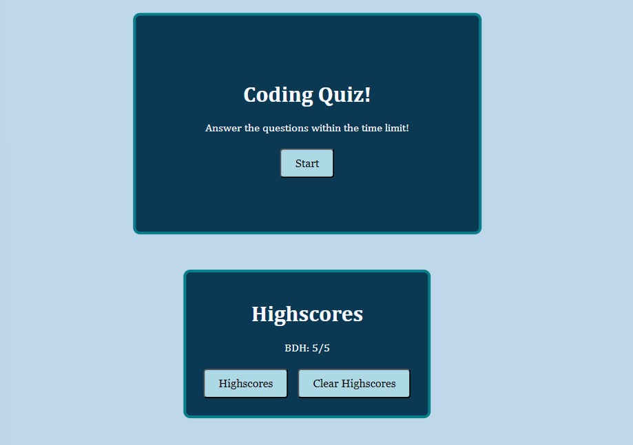

# Coding Quiz
When you click on the start quiz button:

    -A countdown of 60 seconds will start;

    -A question will come up on the screen;

    -4 buttons with the choices will appear;

        -if the user clicks the incorrect choice:

            -a sound will play 

            -15 seconds will be removed from the timer

        -if the user clicks the correct choice:

            -A sound will be played

            -No time will be docked

            -A point will be added to the score count

        -if time runs out:

            -User will be asked for initals

            -User initials and score will be added to the highscore array, in LocalStorage()

            -The array will be pulled on screen, in the highscore card

                -In the same card, user can click a button to clear localStorage(), clearing the card

            -A Start Over button appears in the quiz card

        -if a user completes the test with time remaining

            -The message "Congrats!" will pop up on screen

            -User will ask for thier initals

            -User initials will be added to localstorage, and the highscore card

Screenshot of working app: 

Link to deployed app:

-Note: App includes a highscores button, it doesn't open the card, as I made the decision to just show the highscores on site